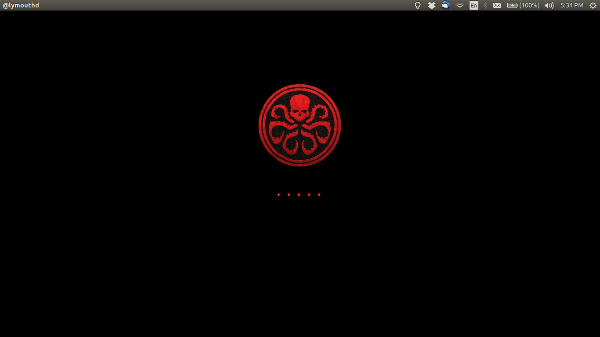

### Preview



### Installtion
Just run `install.sh`

To fix the delayed loading

```sh
echo FRAMEBUFFER=y >>/etc/initramfs-tools/conf.d/splash
update-initramfs -u
```

#### Contact me [@ REVERSIBLEAN's Ubuntu ♛ Linux Blog](http://www.reversiblean.com/contact-us/)


